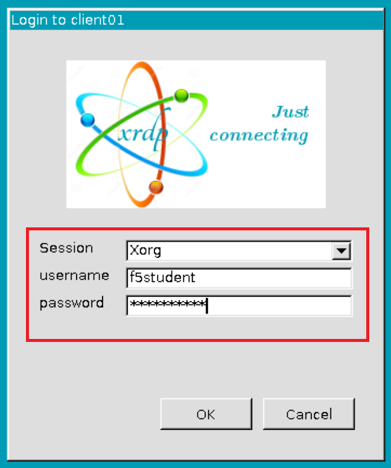

Module 1: ASM Policy Template Creation on BIG-IP
===================================================

For this module we’re going to be using a combination of the F5 TMUI (GUI) and Postman to make API calls to the F5 via AS3.  
AS3 stands for Application Services 3 Extension.  AS3 is a flexible, low-overhead mechanism for managing application-specific configurations on a BIG-IP system. 
AS3 uses a declarative model, meaning you provide a JSON declaration rather than a set of imperative commands. 
The declaration represents the configuration which AS3 is responsible for creating on a BIG-IP system.  To learn more about AS3, you can visit: 

https://clouddocs.f5.com/products/extensions/f5-appsvcs-extension/latest/

**Step 1:** Log into the Linux Client via RDP using the following credentials:

	Username:	f5student

	Password: 	f5DEMOs4u!

**Step 2:** We’re going to be working in the BIG-IP to create an ASM template with some specific settings applied that we can use on our VS.  
Once the template is created, we’ll use AS3 and Postman to add an ASM policy to a VS based on our template to show how to add automation of ASM policies to applications.  

    **2a:** Log into the BIG-IP by opening the FireFox browser in the Linux client and selecting the browser bookmark titled ‘bigip01’ using the following credentials:

        Username:	admin
    
        Password:	f5DEMOs4u!

        .. image:: images/2-module1.png

    **2b:**  Let’s create an ASM policy template that we’ll reference later, by navigating to:
		
		Security  ››  Application Security : Security Policies : Policies List

            Click ‘Create’

            .. image:: images/3-module1.png

    **2c.**	Name the policy ‘waf_Protected’ and set the following settings:

        Policy Template:                                    Rapid Deployment Policy

        Enforcement Mode:	                                Blocking

        Auto-Added Signature Accuracy:	                    Medium

        Signature Staging:                                  Enabled

        Enforcement Readiness Period:	                    7

        Policy is Case Sensitive:	                        Disabled

        Differentiate between HTTP/WS and HTTPS/WSS URLs	Disabled

        .. image:: images/4-module1.png

            Click ‘Save’ to save the policy

    **2d.**	Navigate to:  Security  ››  Application Security : Geolocation Enforcement

        We’re going to create a Geo enforcement on this policy to block North Korea form accessing out site.  
        From the ‘Allowed Geolocations’ on the right, find ‘Korea, Democratic People’s Republic of’ and bring it to the left window titled ‘Disallowed Geolocations’:

        .. image:: images/5-module1.png

        Click ‘Apply’ in the top right of the window.

    **2e.** Navigate to:  ‘Security  ››  Application Security : Policy Building : Learning and Blocking Settings

        If you expand ‘IP Addresses and Geolocations’ you’ll notice that we’re enforcing blocking of the Geolocation that we created in the previous step as well as access from known malicious IP addresses.

        .. image:: images/6-module1.png
    
    **2f.** On this same screen, under the section ‘HTTP protocol compliance failed’ uncheck the boxes to ‘learn’, ‘alarm’, and ‘block’ as shown below. 

        .. image:: images/7-module1.png

        Click ‘Save’ at the bottom of this screen to save our changes.

**Step 3:** Template Creation	

    **3a.**	We’re now going to save this policy as a template.  To do so, navigate to:

	    Security  ››  Options : Application Security : Advanced Configuration : Policy Templates

        On the far right of the screen click ‘Create’

        .. image:: images/8-module1.png

        Name the template ‘owasptop10’ and select ‘waf_protected’ as the Template File and click ‘Create’.

        .. image:: images/9-module1.png

**Step 4:** Now that we have a template created, we’re now done with the BIG-IP for now and are moving onto Postman.  
Postman will be interacting with our BIG-IP via AS3 making API calls.  
Launch Postman from the Linux desktop icon shown below:

        .. image:: images/10-module1.png

    **4a.** Once Postman is open, we need to import the collection (series of declarations we’ll be using on our BIG-IP) from GitHub.  To do so, click on ‘Import’ on the top left of Postman and select ‘Import From Link’ option.  Paste the following into the field where you enter the URL and click ‘Import’

        https://gitlab.com/f5-examples/udf_waf_cicd/-/raw/master/WAF_342_postman_collection.json?inline=false


        .. image:: images/11-module1.png

        With the collection imported, on the left-hand pane of Postman, you’ll see the collection titled ‘WAF_342’ with several declarations under it:

        .. image:: images/12-module1.png

        The first collection does a simple GET request against the lab BIG-IP to ensure that AS3 is installed and running.  
        It will also show you the version of AS3. 

        Click on the selection ‘check if AS3 is ready’ and click ‘Send’.  You should see the BIG IP report back with the following:

        .. image:: images/13-module1.png

        This validates that AS3 is running and responded with version 3.16.0

**Step 5:** We’re now going to make an AS3 declaration to the BIG-IP.  To view the JSON declaration, click on the declaration titled ‘as3 with_declarative_waf_and_vs’ and select ‘Body’ and ‘raw” as shown below:

    .. image:: images/14-module1.png

    In this declaration, we’re going to be creating a new Virtual Server on the BIG-IP, creating an ASM policy by referencing the template created earlier and applying it to the new Virtual Server. This virtual server front-ends a pool member that is running OWASP’s Juice Shop application that has all of the OWASP top 10 vulnerabilities.  

    Also note that the declaration is calling an external URL hosted on Gitlab and is our WAF JSON declaration that will be creating all of the configuration items mentioned above.  If you’d like, you can view the JSON declaration by using the bookmark bar in FireFox on the Linux Desktop and clicking on the ‘WAF_342’ Bookmark folder and clicking on ‘Gitlab’.  The following screen appears:

        .. image:: images/15-module1.png

    **5a.** Click on ‘waf_labs / waf_cicd’ and at the bottom of the page you’ll see ‘waf_policy.json’.  Click on that to view the JSON file:

        **Note in the top section you’ll see the name “owasptop10’.  This refers to the template we created on the BIG-IP to build the ASM policy and matches the name of the template we created in the BIG-IP.

        .. image:: images/16-module1.png

    **5b.** Return to Postman and run the declaration titled ‘as3_with_declarative_waf_VS_create’ by clicking ‘Send’ on the far right of the screen.  If it finished successfully, you’ll see the following response from the BIG-IP in Postman.

        .. image:: images/17-module1.png

    **5c.** Validate that the ASM policy has been created via the previous step by logging into the BIG-IP with the following credentials.  

        Username:	admin
		Password:	f5DEMOs4u!

		Once logged in, go to: 

            Security  ››  Application Security : Security Policies : Policies List
	
            There you’ll see the policy titled ‘waf_juiceshop_secops_testing’ under the newly created ‘secops_testing’ partition:

                .. image:: images/18-module1.png

            This declaration also created a VS on the BIG-IP called ‘juiceshop_secops_testing’ with the security policy ‘waf_juiceshop_secops_testing’ WAF policy applied.

                .. image:: images/18-module1.png

            This ends module 1.

.. toctree::
   :maxdepth: 1
   :glob:

   lab*/lab*
   review

