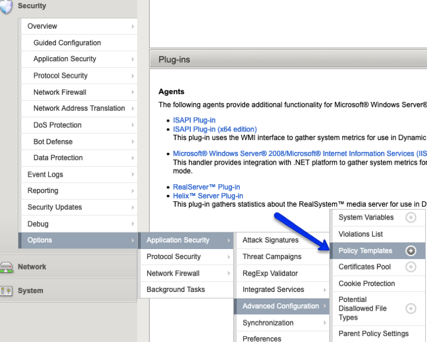

Lab 2.3: Remediate ASM Policy to Pass WAF Tester
=====================================================

According to sources, Capital One suffered a data breach which was announced in late July of 2019.  
Although protected by a WAF, it was misconfigured and not able to stop the attack executed by Paige Thompson, 
aka "erratic".  Paige used an exploit called Server Side Request Forgery (SSRF) to compromise a web server
and access roughly 100 million credit card applications among other PII data. Capital One is estimating this data breach will 
cost the company $100 to $150 million dollars in the near term.  

We will look through the report of the f5 WAF tester to see if any SSRF attacks failed.

2.3.1 - Review f5 WAF Tester report
~~~~~~~~~~~~~~~~~~~~~~~~~~~~~~~~~~~~

Look for any failed Server Side Request Forgery.

To quickly search the report we will issue a simple jq command.

	From the Terminal type (make sure you are in directory ~/.local/bin): 

		.. code-block:: bash

			cat report.json | jq '.details[]| select(.attack_type | contains ("Server Side Request Forgery")) | .attack_type, .results[]'

    You should see that one SSRF protection failed due to the attack signature not being in the ASM Policy
	
2.3.2 - Modify WAF Policy
~~~~~~~~~~~~~~~~~~~~~~~~~~~~~~~~~~~~~

Modify Policy named base_policy (change staging, enable signatures).

    Enable SSRF signatures
   
2.3.3 -	Run the f5 WAF Tester Again 
~~~~~~~~~~~~~~~~~~~~~~~~~~~~~~~~~~~~~

To make sure the SSRF attacks are stopped.

    From the report you should now see that the signature is in staging.  
    
    Disable staging and run the test again.

2.3.4 -	Update the Security Template
~~~~~~~~~~~~~~~~~~~~~~~~~~~~~~~~~~~~~~

With the new settings.

    Go to Security -> Options -> Application Security -> Advanced Configuration -> Policy Templates.

	Click on owasptop10 template

	Under the Template File line, choose “Use existing security policy” and select the policy you just modified.

	Click Update.

    **End of Module 2**