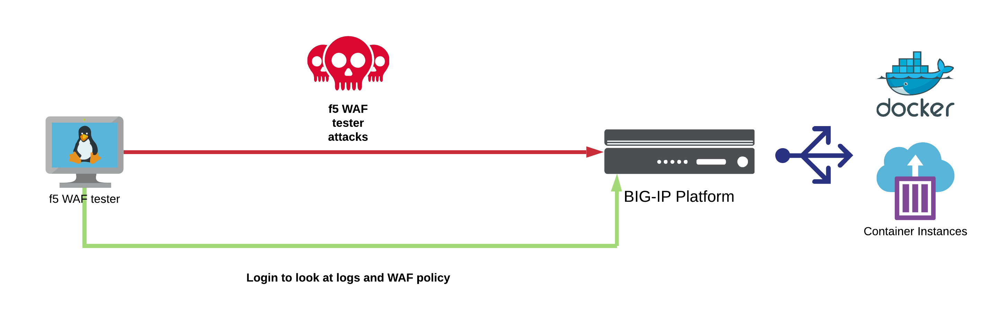

Module 2: Policy testing - Intro to f5 WAF Tester
========================================================

Expected time to complete: **30 minutes**

**f5 WAF Tester**

f5 Network's Threat Research Team has created a tool that provides an easy and fast way to integrate security testing as part of the SDLC process for basic application protection health check before moving to production.
The tool is intended to test the WAF configuration state and its provided security posture against common web attack types. The tool will send HTTP requests containing attacks and will expect to receive a WAF blocking page in the response. In case the attack vector was not blocked, the tool will read the WAF logs and its configuration to try determine possible reasons for the attack not being blocked, and suggest corresponding actions.

**Disclaimer**: The tool is not testing whether the application itself is vulnerable and also tests only a subset of attacks. The tool tries to test the WAF security policy level, and is not a replacement for a vulnerability scanner assessment.

If you would like to see the GitHub repository for the tester, it can be found here:

https://github.com/f5devcentral/f5-waf-tester

.. toctree::
   :maxdepth: 1
   :glob:

   lab1/lab1
   lab2/lab2
   lab3/lab3
   lab4/lab4
   lab5/lab5
