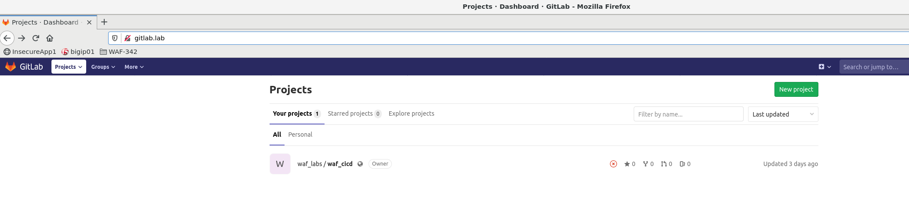
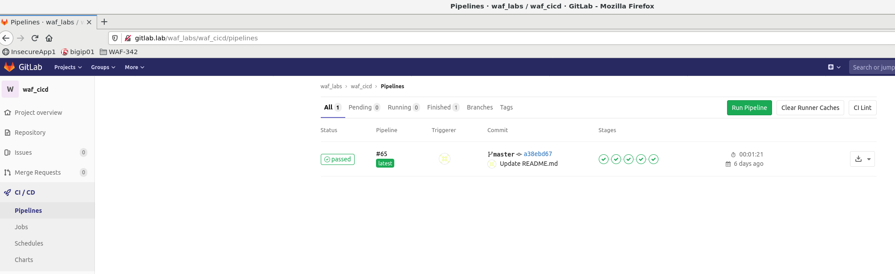
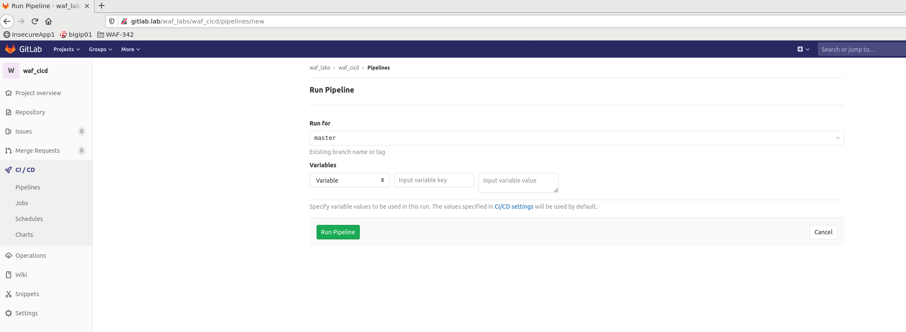
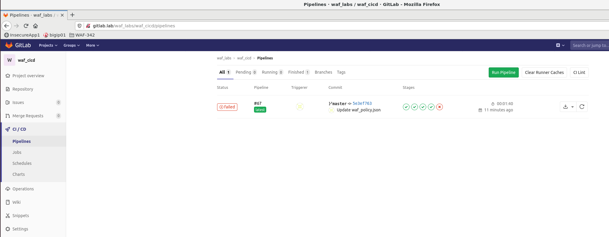

Lab 3.1: Build, Test and Deploy Juice-shop Web App Staging ENV via Gitlab CI/CD
=========================================

Staging Pipeline
----------------
we are starting with a staging pipeline that will build the app and deploy it to the staging environment. 
the pipeline is built from the *master* branch. 
here are the highlevel stages we are going to excetute:

Login to GitLab
~~~~~~~~~~~~~~~~~~~~~~~~~~~~~~~~~~~~~~~~~~~~~~~~~~~~~

in the linux client RDP session open firefox and click gitlab from the waf_342 favorites folder 

:guilabel:`client RDP` -> :guilabel:`firefox` -> :guilabel:`waf342` -> :guilabel:`gitlab`

.. image:: images/gitlab_login.png

Login with the provided credentials (see :ref:`Credentials <credentials>`) and click on :guilabel:`waflabs / waf_cicd` Project

Run Staging Pipeline
~~~~~~~~~~~~~~~~~~~~~~~~~~~~~~~~~~~~~~~~~~~~~~~~~~~~~

Navigate to :guilabel:`CI / CD` -> :guilabel:`Pipelines` and click on :guilabel:`Run Pipeline`

Then click on |run|

Pipeline progress
-----------------

Watch the pipeline as it progresses through its stages. You can see the output of individual stage by clicking on corresponding Job in the pipeline.
To learn more about GitLab Jobs, see |Job|

.. |Job| raw:: html

    <a href="https://docs.gitlab.com/ee/ci/quick_start/ target="_blank">Gitlab Job</a>

It is **expected** that the pipeline will fail for the first time. This is due to the WAF Policy being too strict and not allowing a `Trusted Traffic` through.
Click on :guilabel:`Functionality tests` Job to see more details about the failure

.. note:: The Functionality_tests job sends 3 requests to validate that WAF Policy allows for retrieval of YAML, JSON and .bak extension files, 
          as those are used by users of the app. 
  Original policy uses 'POLICY_TEMPLATE_RAPID_DEPLOYMENT' template which blocks such requests if they are not included in modifications section of the policy.

OPTIONAL: Manually test WAF Policy for trusted traffic
---------------------------------------------

With automated WAF Policy testing built into the pipeline there is no need to run any manual testing, 
for learning purposes you can send the 'trusted traffic', check the response and check the AWAF logs. 
in the client linux terminal: 

    .. code-block:: console

        curl http://10.1.10.150/ftp/packages.json -v
        curl http://10.1.10.150/ftp/errors.yml -v
        curl http://10.1.10.150/ftp/security_report.json.bak -v

The expected result should look something like the following: (AWAF default blocking page) 
<html><head><title>Request Rejected</title></head><body>The requested URL was rejected. Please consult with your administrator.  Your support ID is: 15023059139070787972  <a href='javascript:history.back();'>[Go Back]</a></body></html>

Apply policy suggestion
---------------------------------------------

At this point it's necessary to update WAF Policy to allow for trusted traffic to pass through.

AWAF generates suggestions based on the 'policy builder'. in this use case, policy builder will mainly be used to 'relax' the policy and disable restrictions. 

OPTIONAL: Examine AWAF suggestions through the GUI 
---------------------------------------------

1. Open the bigip GUI :guilabel:`firefox` -> :guilabel:`bigip01`
2. Navigate to 'traffic learning' :guilabel:`security` -> :guilabel:`application security` -> :guilabel:`policy building` -> :guilabel:`traffic learning`
3. Check that you are looking at 'juiceshop_waf_policy_staging'
3. review the suggestions

question - why did the request to http://10.1.10.150/ftp/packages.json was blocked ? what is the required policy change ? 

Reviewing policy suggestions in the GIT repo  
---------------------------------------------

The pipeline performs the following steps:
1. sends trusted traffic 
2. check if trusted traffic is blocked 
3. if trusted traffic is blocked, use the BIGIP API to get policy suggestions (from policy builder) 
4. push the updated policy declaration with the new suggestions to a new git branch (dev)

What's Next?

:doc:`Apply WAF Policy Suggestions <lab2>`

