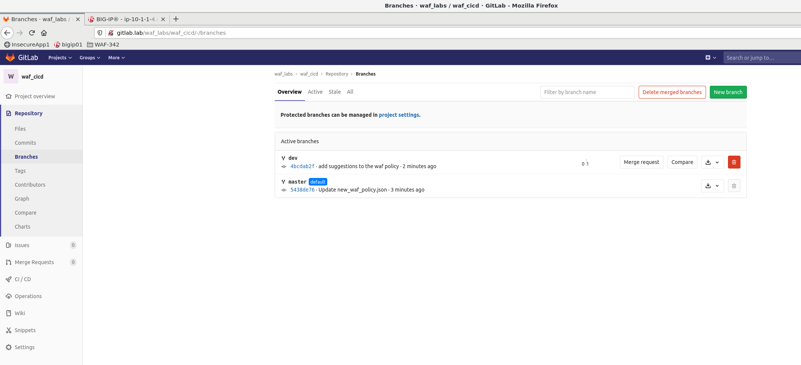
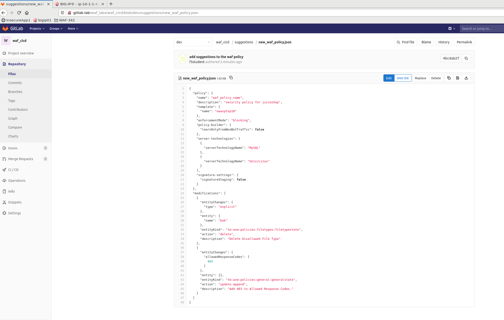
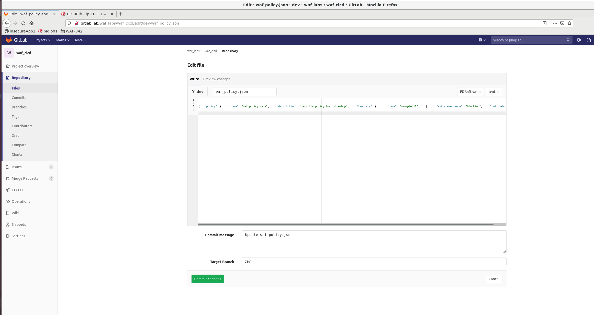
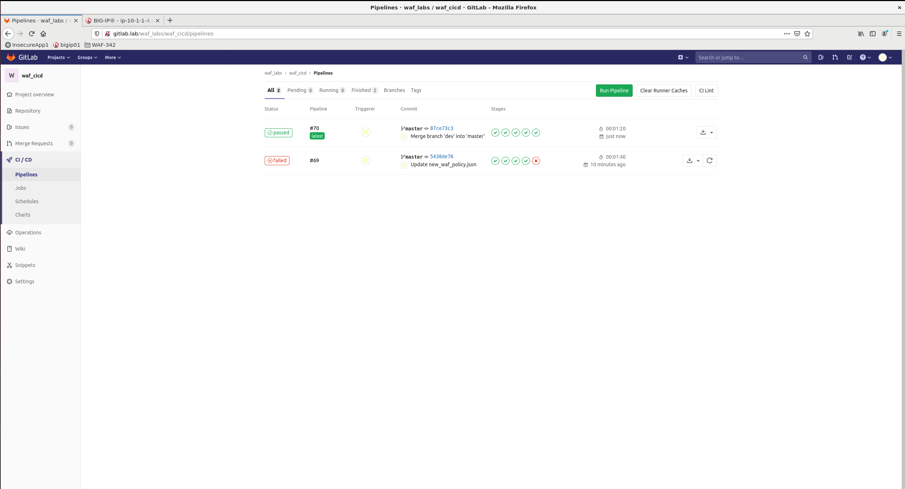

Apply WAF suggestions for trusted traffic
=========================================

.. _lab2:

The pipeline performs the following steps:
1. sends trusted traffic 
2. check if trusted traffic is blocked 
3. if trusted traffic is blocked, use the BIGIP API to get policy suggestions (from policy builder) 
4. push the updated policy declaration with the new suggestions to a new git branch (dev)

Explore the updated policy JSON
-------------------------------

In GitLab navigate to :guilabel:`Repository` -> :guilabel:`Branches` and click on **dev**

Click on  :guilabel:`Suggestions` folder and finally click on :guilabel:`new_waf_policy.json`

Explore the policy and notice the *modifications* section. It should contain a few suggested changes to allow  Trusted traffic:

.. code-block:: json

    {
      "entityChanges": {
        "type": "explicit"
      },
      "entity": {
        "name": "bak"
      },
      "entityKind": "tm:asm:policies:filetypes:filetypestate",
      "action": "delete",
      "description": "Delete Disallowed File Type"
    }

.. code-block:: json

    {
      "entityChanges": {
        "allowedResponseCodes": [
          403
        ]
      },
      "entity": {},
      "entityKind": "tm:asm:policies:general:generalstate",
      "action": "update-append",
      "description": "Add 403 to Allowed Response Codes."
    }

.. note:: For the purposes of this lab, in order to avoid copy/paste errors, we have the script configured to build an entire new policy definition file rather than copy and paste just the modifications section

Update original WAF Policy JSON
-------------------------------

Click on `Copy source to clipboard` button for new_waf_policy.json content and navigate back to root folder of the repo:

.. image:: images/copy.png

Open `waf_policy.json` file for editing and perform `CTRL-A/CTRL-C` to paste the content of `new_waf_policy.json` and overwrite the original policy file:

.. image:: images/edit.png

.. note:: Depending on Web Browser type, it is possible that during copy/paste `new_waf_policy.json` is "minified" i.e. you see a single line instead of a multi-line structured file. This format **does not** affect the JSON structure but can be "prettified" to be more "human-readable" using one of many available tools, for example |Beautifier|

    .. |Beautifier| raw:: html

            <a href="https://www.csvjson.com/json_beautifier" target="_blank">JSON Beautifier</a>

Click on :guilabel:`Commit changes` radio button

Merge dev to master and run staging CI/CD pipeline
---------------------------------------------------------

Create a new merge request by clicking on a corresponding radio button. Then scroll down to the botton of the page and click :guilabel:`Submit merge request`

.. image:: images/create_merge_request.png

.. note: Normally App owner would approve or close a merge request based on the nature of the change, number of changes etc.

Once merge request is submitted, click on :guilabel:`Merge` radio button to synchronize dev and master branches and trigger a Staging Pipeline.
You can click on Pipeline # to get to the status page of that pipeline:

.. image:: images/merged.png

Pipeline progress
-----------------

Watch the pipeline as it progresses through its stages. You can see the output of individual stage by clicking on corresponding Job in the pipeline.

It is expected that the pipeline will succeed and *Staging Juice-Shop App* will be deployed with corresponding WAF Policy attached.

OPTIONAL: Test WAF Policy by manually sending trusted and then malicious traffic 
--------------------------------------------------------------------------------

With automated WAF Policy testing built into the pipeline there is no need to run any manual testing, 
however in this lab you can still test WAF policy blocking by running the following commands:
in the client linux terminal: 

    .. code-block:: console

        curl http://10.1.10.150/ftp/packages.json -v
        curl http://10.1.10.150/ftp/errors.yml -v
        curl http://10.1.10.150/ftp/security_report.json.bak -v

Expected result should look like that:

.. code-block:: console

Since we applied an updated WAF Policy, it now allows trusted traffic to pass through. 

Now we should ensure that malicious traffic is blocked by WAF by running a **malicious_traffic.sh** script from citools VM.

.. note:: Pipeline uses 4 different requests that simulate cross-site scripting, access to FTP directory, login and password "guessing" attempts. This is just an example. In real customer environment these tests will be much more comprehensive and may include a 3rd party software designed for penetration testing.

    .. code-block:: console
    
        curl "http://10.1.10.101/api/Products/1" -H "Content-Type:application/json" --data-binary '{"description":""}'
        curl "http://10.1.10.101/ftp/package.json.bak%2500.md"
        curl "http://10.1.10.101/index.php?username=1'%20or%20'1'%20=%20'1&password=1'%20or%20'1'%20=%20'1"
        curl "http://10.1.10.101/rest/user/change-password?current=abcde&new=slurmCl4ssic&repeat=slurmCl4ssic"

  These requests are also part of *malicious_traffic.sh* script

.. code-block:: console

  ubuntu@ip-10-1-1-6:~$ ./malicious_traffic.sh 
  Sending malicious requests...
    % Total    % Received % Xferd  Average Speed   Time    Time     Time  Current
                                   Dload  Upload   Total   Spent    Left  Speed
  100   297  100   247  100    50   120k  25000 --:--:-- --:--:-- --:--:--  145k
  XSS request rejected
   % Total    % Received % Xferd  Average Speed   Time    Time     Time  Current
                                  Dload  Upload   Total   Spent    Left  Speed
  100   247  100   247    0     0   241k      0 --:--:-- --:--:-- --:--:--  241k
  FTP request rejected
   % Total    % Received % Xferd  Average Speed   Time    Time     Time  Current
                                  Dload  Upload   Total   Spent    Left  Speed
  100   247  100   247    0     0   241k      0 --:--:-- --:--:-- --:--:--  241k
  Login attempt rejected
    % Total    % Received % Xferd  Average Speed   Time    Time     Time  Current
                                   Dload  Upload   Total   Spent    Left  Speed
  100   247  100   247    0     0  14529      0 --:--:-- --:--:-- --:--:-- 15437
  Password attempt rejected

At this point WAF Policy appears to be allowing trusted traffic while blocking malicious requests. Pipeline jobs reported the same result so it's time to test the connectivity to **staging** Juice-Shop App

Staging Juice-Shop App
----------------------

Upon successful pipeline completion you can access Juice-Shop App by selecting :guilabel:`firefox` --> :guilabel:`favorites` --> :guilabel:`OWASP juice shop`

.. image:: ../../_static/juiceshop_staging.png

Pipeline Summary
----------------

Demonstrated pipeline uses new AWAF capabilities to deploy a base WAF Policy, 
Test the policy against Trusted Traffic and Malicious requests. 
Furthermore, WAF Policy was updated to allow certain requests to pass, as an outcome of an automated policy update following the export of Policy Suggestions from AWAF.
 * Deploy WAF Policy
 * Notify ChatOps
 * Test and update policy as necessary
 * Repeat

What's Next?

:doc:`Deploy Juice-Shop App to Production <lab3>`
