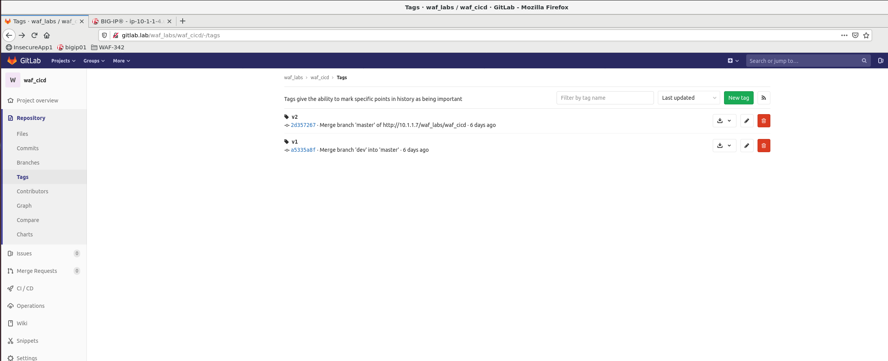
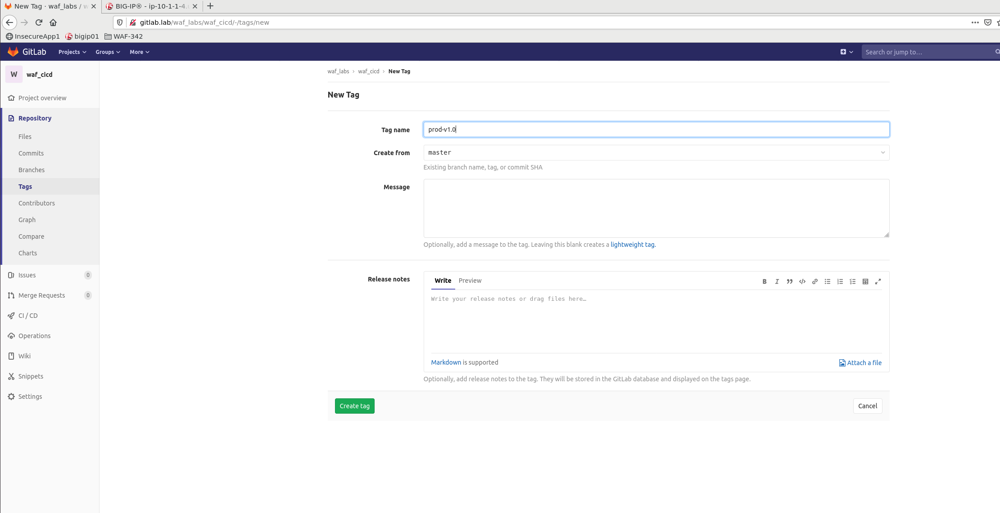

Deploy Juice-shop Web App to Production ENV and run DAST
========================================================

.. _lab3:

Production Pipeline
-------------------

.. image:: images/pipeline_prod.png

Deploy Juice-Shop App to Production and run DAST
------------------------------------------------

Production deployment is triggered by creating a Tag. 
This is a common development practice that allows tagging and simultaneous release/delivery of the App code into Production environment.
You can read a bit more about deployment strategies at |dev.to| or similar websites

**Why do we use tags?**

* Useful for marking deployments and releases
* Annotated tags are an unchangeable part of Git history
* Soft/lightweight tags can be set and removed at will
* Many projects combine an annotated release tag with a stable branch
* Consider setting deployment/release tags automatically

More on tagging at |git|

.. |git| raw:: html

            <a href="https://git-scm.com/book/en/v2/Git-Basics-Tagging" target="_blank">Git Basics - Tagging</a>

.. |dev.to| raw:: html

            <a href="https://dev.to/mostlyjason/intro-to-deployment-strategies-blue-green-canary-and-more-3a3" target="_blank">Intro to deployment strategies</a>

Navigate to :guilabel:`Repository` -> :guilabel:`Tags` and click on :guilabel:`New tag`

Fill out a **Tag name** field and click on :guilabel:`Create tag`. You can use **prod-v1.0** as suggested Tag name.

Pipeline progress
-----------------

Navigate to :guilabel:`CI / CD` -> :guilabel:`Pipelines` and click on the pipeline that is currently running and has a **Commit** message set to a Tag name created in previous step

.. image:: ../../_static/prod_pipeline.png

Connect to Production Juice-Shop App
------------------------------------

In UDF navigate to :guilabel:`AdvancedWAF` -> :guilabel:`ACCESS` -> :guilabel:`JUICE SHOP PROD`
This will open a welcome page of the App:

.. image:: images/connect_prod.png

OPTIONAL: Download and explore DAST report
------------------------------------------

Click on :guilabel:`DAST` Job in the pipeline and then :guilabel:`Download` to download Job artifact. 
Report contains findings and security issues as discovered by GitLab DAST service

.. image:: images/DAST.png

Pipeline Summary
----------------

Demonstrated pipeline uses same WAF Policy for Production as it did for Staging environment, making both environments identical from the security perspective. Additionally, Production pipeline uses DAST testing to rule out any runtime vulnerabilities.
 * Deploy WAF Policy
 * Test and update policy as necessary
 * Repeat

What's Next?

:doc:`Cleanup Staging ENV <lab4>`